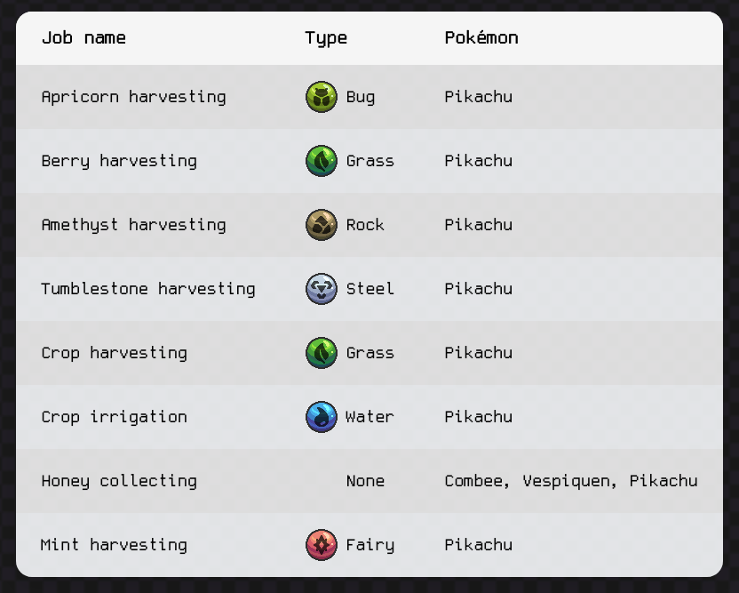

# Cobbleworkers

Cobbleworkers is a companion server-side mod for Cobblemon `1.6.1` that turns the **Pasture Block** into a powerful utility block.

## Features

By default
- **Crop Irrigation** – Water-types keep crops hydrated.
- **Crop Harvesting** – Grass-types assist with crop harvesting.
- **Berry Collection** – Grass-types assist with berry harvesting.
- **Apricorn Harvesting** – Bug-types pick apricorns for you.
- **Amethyst Mining** – Rock-types collect amethyst clusters nearby.
- **Tumblestone Harvesting** – Steel-types collect tumblestone.
- **Honey Collection** – The combee line gathers honeycombs from beehives.

Pokémon will automatically place all of the items in inventories nearby!

## Configuration
Each job can be customized via a config file. Enable/disable job types and specify which Pokémon can perform them.

Cobbleworkers uses [Cloth Config](https://www.curseforge.com/minecraft/mc-mods/cloth-config) and [Mod Menu](https://www.curseforge.com/minecraft/mc-mods/modmenu) for easy in-game tweaking
when using the minecraft integrated server, for servers use the config file.

## License
Licensed under [MPL-2.0](https://mozilla.org/MPL/2.0/)
